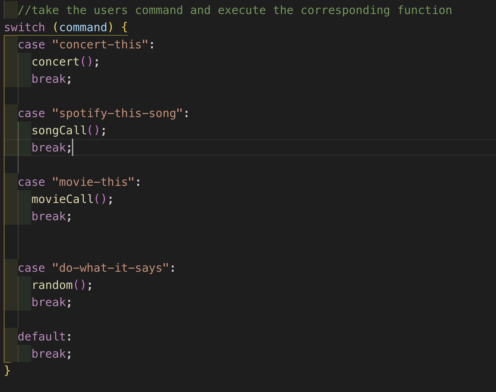

Liri-bot is a CLI App driven by Node.js that uses APIs from Spotify to get songs, Bands in Town to get concerts and OMDB to get movies. Axios is used to make these API calls.

Calls that are made are stored to a log.txt file using npm's fs and the application can also read the contents of a file entitled random.txt by parsing out the commands into a switch case.

How it works:

1. The use runs the program by calling node liri "command" "arguments/details about the command"

The command must be entered as a hyphenated sentence and is stored as a variable, which then uses a switch case to initiate the appropriate function:

2. Each function is structured similarly and just parses out the object data to return the users desired result.

3. The do-what-it-says command calls the random() function, which then parses out the data from the random.txt file and repeats the switch.

Video Demonstration:

https://drive.google.com/file/d/1VRir_1OYNuA-JzKdJ1mWt2WpU0V1avlX/view

